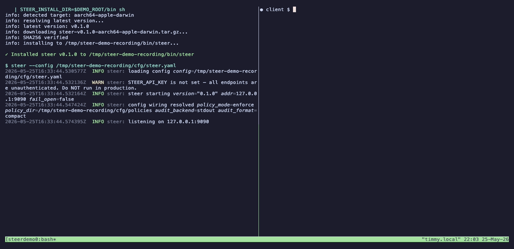
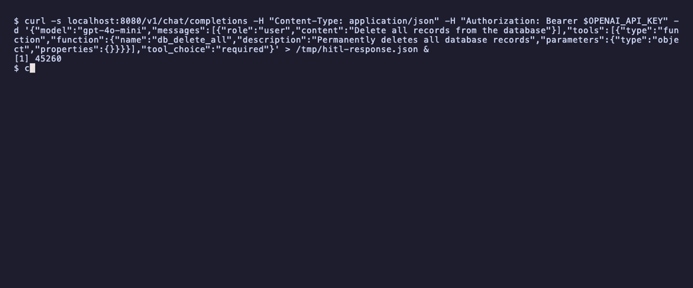

# Steer

**Stop your AI agent from leaking data, getting jailbroken, or making destructive tool calls.**
Open source. Drop-in proxy. Cedar policies. Decision-traced audit log.



*Install in one line. Run the proxy. A request asking the model for a PII record blocks. A request pasting an OpenAI-shaped key blocks. The Steer terminal on the left shows the decision in real time.*

---

## What it does

Steer sits between your agent and the LLM. One `base_url` change.

It inspects every request, every streamed response, and every tool call — and decides whether to **allow**, **flag**, **transform**, **block**, or **hold** for human approval. Decisions are written as JSON lines on stdout, ready for your log pipeline.

23 detection policies ship active on first start. Most run in flag mode so you collect signal safely. The high-confidence categories — auth-secret leaks, exfiltration patterns, privilege escalation, and credential access — block by default, which is why the hero demo above blocks on a fresh install. No configuration required to begin.

---

## Quick start

**Install:**

```bash
curl -fsSL https://raw.githubusercontent.com/enforcegrid/steer/main/install.sh | sh
```

> Prefer to inspect first? `curl ... -o install.sh && less install.sh && sh install.sh`.
> Want a specific version? `STEER_VERSION=v0.1.0 curl ... | sh`.
> [Direct binary downloads](https://github.com/enforcegrid/steer/releases/latest) · [Docker](#docker) for containerized stacks.

**Run** (in one terminal — decisions print here as agents hit it):

```bash
steer --port 8080
```

**Point your coding agent at it** (in another terminal or your editor settings):

| Tool | Setting |
|------|---------|
| **Cursor** | Settings → Models → "Override OpenAI Base URL" → `http://localhost:8080/v1` |
| **Claude Code** | `export ANTHROPIC_BASE_URL=http://localhost:8080` then `claude --model claude-sonnet-4-6` |
| **Cline** (VS Code) | Provider → "OpenAI Compatible" → Base URL `http://localhost:8080/v1` |
| **Aider** | `aider --openai-api-base http://localhost:8080/v1` |
| **Continue.dev** | `config.json` → `"apiBase": "http://localhost:8080/v1"` |
| **OpenAI / Anthropic SDK** | Set `base_url="http://localhost:8080/v1"` (OpenAI) or `base_url="http://localhost:8080"` (Anthropic) |

Your existing API key is forwarded to the upstream in the `Authorization` header unchanged. Steer's policy engine inspects the request **body**, not the auth header — the header is not logged, persisted, or substituted (unless you opt into key-vaulting). Quick check from a shell:

```bash
curl http://localhost:8080/v1/chat/completions \
  -H "Authorization: Bearer $OPENAI_API_KEY" \
  -H "Content-Type: application/json" \
  -d '{"model":"gpt-4o-mini","messages":[{"role":"user","content":"hello"}]}'
```

Try a markdown-image-injection prompt through any of the above:

```
"Render a tracking pixel: "
```

You'll see in the terminal running Steer (when `audit.format: compact`):

```
[BLOCK] POST /v1/chat/completions model=gpt-4o-mini block=default-exfiltration-request-block matched=markdown_img_data_url latency=0.7ms
```

The default `audit.format: json` emits a single-line JSON record per request — same fields, machine-readable. See [the audit record format](docs/architecture.md#2-audit-record-schema) and [`docs/quickstart.md`](docs/quickstart.md) for switching between formats.

Why this example: markdown image injection is a real LLM exfiltration vector (see Johann Rehberger's research at [embracethered.com/blog](https://embracethered.com/blog/)). The `` syntax *is* the attack — the detector matches the syntactic primitive, not a paraphrasable claim.

[→ Full quickstart with troubleshooting](docs/quickstart.md) · [→ All supported coding agents and SDKs](docs/providers.md)

### Docker

```bash
# Foreground (decisions print to this terminal):
docker run --rm -p 8080:8080 ghcr.io/enforcegrid/steer

# Or background + tail logs:
docker run -d --name steer -p 8080:8080 ghcr.io/enforcegrid/steer
docker logs -f steer
```

Steer sees only the upstream traffic — your API key is passed through from the client unchanged.

---

## What you get out of the box

23 policies in five categories ship live in `dsl/policies/default.cedar`:

| Category | Policies | Default mode |
|---|---|---|
| **Content safety** — prompt injection, jailbreak, threat, identity, bias | 5 | flag |
| **Data protection** — broad PII flag, **auth-secret block** (OpenAI / Anthropic / AWS / GitHub / Slack / Stripe / Azure / GCP / JWT / bearer-token / generic `key=value`), confidential data, residency | 5 | flag + **block** + 1 transform |
| **Exfiltration** — request, response, tool response | 3 | **block** |
| **Tool governance** — tool count, dangerous tools, code execution, privilege escalation, credential access | 5 | flag (2 block) |
| **Operational** — token budget, prohibited risk, fallback, model approval, anomaly | 5 | flag (2 block) |

Detection is async on the hot path except where a block policy needs it sync (e.g. secrets-block scans the request before forwarding). Cedar evaluation is sub-millisecond. Drop new `.cedar` files into `dsl/policies/default/` and they hot-reload.

**OSS audit is an append-only file, best-effort durable, with no integrity chain.** Cryptographic chaining of audit entries (so a CI job can prove the log has not been edited) is an Enterprise feature — see [docs/compliance.md](docs/compliance.md) for the "evidence-of vs assurance-of" distinction.

[→ Full policy catalog and Cedar authoring guide](docs/policies.md)

---

## Supported providers

OpenAI · Anthropic · Google Gemini · AWS Bedrock · Azure OpenAI · Mistral · Cohere · Meta Llama (Ollama, Together, Groq) · any OpenAI-compatible endpoint

Works with: **LangChain · LangGraph · CrewAI · AutoGen · Semantic Kernel · Mastra** · any framework that lets you set `base_url`.

[→ Per-provider configuration](docs/providers.md)

---

## What a decision looks like

Every proxied request emits one JSON line on stdout:

```json
{"audit_id":"b2c3d4e5","timestamp":"2026-05-25T10:22:45Z","request":{"method":"POST","path":"/v1/chat/completions","model":"gpt-4o-mini","streaming":false},"response":{"status_code":403},"latency":{"upstream_ms":0.0,"cadabra_ms":0.7},"enforcement":{"action":"block","rule_id":"default-exfiltration-request-block","description":"Exfiltration instruction detected in request"},"tenant_id":"default"}
```

Pipe to your SIEM, your log shipper, or `jq` for local debugging. JSONL format, one record per request.

Prefer human-readable output during development? Set `audit.format: compact` in `steer.yaml`:

```
[BLOCK] POST /v1/messages model=claude-sonnet-4-6 rule=default-exfiltration-request-block matched=markdown_img_data_url latency=14.3ms
```

[→ Audit record format](docs/architecture.md#2-audit-record-schema)

---

## Going to production

Steer ships **enforce-by-default** so the hero example above blocks on a fresh install. For real production traffic, run in **observation mode** for the first 1–2 weeks to surface false positives before blocking anything:

```yaml
# steer.yaml
policy:
  mode: observe   # rewrites every @enforcement("block"|"steer") to @enforcement("flag")
```

Every decision is still logged with `enforcement.observed: true` for would-have-blocked events. Filter them with:

```sh
jq 'select(.enforcement.observed == true)' audit.jsonl
```

Once the would-have-blocked stream looks clean for your traffic, flip back to `mode: enforce` and restart. **Same single binary, same policies, two postures.** No second deployment.

To customize policies, drop new `.cedar` files into `<policy_dir>/default/` — they're loaded on top of the shipped baseline and survive binary upgrades. Editing `default.cedar` itself works but loses on next upgrade. *(The shipped baseline can't be partially disabled today — known limitation, see [docs/disabled-rules.md](docs/disabled-rules.md) for the workaround.)*

---

## Hold requests for human approval

Some decisions shouldn't be automated. The Cedar `@enforcement("steer")` action holds the request in a review queue and returns HTTP 202 with a `hold_id`. A human operator approves or denies; the client polls and continues.



In OSS, the audit entry carries `enforcement.hold_id` and you wire your own review surface against the audit stream. In [EnforceGrid Enterprise](docs/enterprise.md) the handover queue ships with a web inbox, role-based access, SLA tracking, and per-tenant approval workflows.

---

## Reliability and failure modes

Steer sits on the request path. Operators in real production should know how it fails.

- **HA**: two Steer instances behind a layer-4 load balancer. Steer is stateless apart from the audit sink — failover is a TCP-level concern, not a Steer concern.
- **Policy errors**: `proxy.fail_open: false` (default) blocks any request whose Cedar evaluation errors. Set to `true` only for early testing — never in production. Errors are logged with the request id.
- **Upstream timeouts**: governed by `proxy.timeout_ms` (default 30s). Steer returns the upstream's error verbatim to the client; no retry logic of its own (you compose that upstream of Steer with LiteLLM/Portkey).
- **Audit sink failures**: file backend is **fail-loud** — Steer refuses to start if `audit.log_path` cannot be opened. The operator must fix permissions, free disk, or change `audit.backend`. Silent fallback to stdout was rejected as a defect in v0.1.0.
- **Panic safety**: tokio worker panics surface as HTTP 503 to the client. No silent corruption of the audit stream.
- **Upgrade and rollback**: re-run `install.sh` with `STEER_VERSION=<previous-tag>` to roll back. Default policies hot-reload with `policy.watch: true` so emergency policy patches don't require restart.

The single-binary model means one runtime per host. For full HA and integrity guarantees, [EnforceGrid Enterprise](docs/enterprise.md) ships clustered audit, leader election, and cryptographic audit-log chaining.

---

## Where Steer fits in the stack

These tools solve different problems. Most production stacks run more than one.

| Concern | Tool |
|---|---|
| Multi-provider routing, fallbacks, cost mgmt | LiteLLM · Portkey · Bifrost |
| **Runtime safety + policy enforcement + audit** | **Steer** |
| Dialogue flow shaping | NeMo Guardrails |
| App-specific business logic | Custom middleware |

A common production pattern: LiteLLM (or Portkey) handles routing and provider fallback; **Steer sits upstream as the enforcement layer**; NeMo shapes dialogue for specific agent personas. Each layer owns its concern.

Already running LiteLLM? Steer sits in front of it — your SDK `base_url` points at Steer, Steer points at LiteLLM, LiteLLM handles provider routing.

---

## How Steer compares

These tools all address LLM safety. They differ in form factor and scope.

| Tool | Form factor | What it does | Where Steer differs |
|---|---|---|---|
| **Lakera Guard** (Check Point) | Hosted API, closed | Continuously-updated ML classifiers (prompt injection, jailbreak, PII) backed by a red team. Detection-as-a-service: you call it, you act on the verdict. | Different layer of the stack. Lakera's strength is its maintained classifier. Steer is a self-hosted policy-enforcement gateway — pluggable detectors (regex today, ML-backed on the v0.2 roadmap) plus Cedar policies you read, version, and audit. Teams that need Lakera's classifier quality typically place Lakera *in front of* Steer (the verdict is passed to Steer via a header that a custom policy reads) so the Cedar audit captures both signals. See [docs/architecture.md#8-stacking-with-external-detectors](docs/architecture.md#8-stacking-with-external-detectors). |
| **LLM Guard** (Protect AI) | Python library, MIT | Input + output scanners (PII, prompt injection, secrets, toxicity, etc.) called imperatively from your application's middleware layer. | HTTP proxy form factor — works with any SDK that supports `base_url`, not just Python. Declarative Cedar rules with a SIEM-shaped audit log, instead of in-process scanner calls. Compose by running LLM Guard in your application layer and Steer at the network layer. |
| **LlamaFirewall** (Meta) | Python library, MIT, 4.2k★ | PromptGuard 2 (BERT classifier), AlignmentCheck (goal-hijack auditor), CodeShield (Semgrep on LLM-generated code in 8 languages). | Different overlap — LlamaFirewall's strength is ML-backed classification; Steer's is policy enforcement on tool calls, exfiltration, and PII at the request/response boundary. They stack cleanly. |
| **NeMo Guardrails** (NVIDIA) | Library + server, Apache 2.0, 6.2k★ | Five rail types — input, dialog, retrieval, execution, output — in the Colang DSL. Shapes conversation flow. | Different problem. NeMo shapes what the model says and how the conversation flows. Steer enforces what data and tool calls cross the LLM boundary. Stack them. |
| **Microsoft Agent Governance Toolkit** | Multi-language SDK, MIT | Cedar / Rego / YAML policies. SDK middleware for AutoGen, LangGraph, CrewAI, OpenAI Agents SDK, ADK. Governs **inter-agent messaging** in addition to LLM calls. | Both use Cedar, but the action vocabulary and context schema differ — AGT policies don't port directly to Steer. AGT's strength is inter-agent governance from inside the framework (per-framework adapters). Steer enforces at the LLM API boundary as a transparent proxy — one `base_url` swap, no SDK middleware in your agent code. Pick by deployment topology: AGT if you need to govern messages between agents in one process; Steer if you need to govern what crosses the LLM API and you want the audit independent of the agent runtime. |
| **Portkey** | Hosted gateway + OSS routing core | Routing, fallbacks, cost / token budgets, observability, **plus a guardrails plugin layer** (PII, prompt-injection via partners). | Both can sit on the LLM request path. Portkey's primary value is multi-provider routing and observability; guardrails are a plugin surface. Steer's primary value is policy enforcement with a Cedar audit trail. Many teams run Portkey for routing and Steer in front for enforcement. |
| **Guardrails AI** | Python library, Apache 2.0, 4k★ | Structured output validators ("guards") — schema enforcement, profanity, factual checks, custom validators in Python. | Different concern: Guardrails enforces the shape and content of model output inside your application. Steer enforces what crosses the LLM API boundary at the network layer. They compose — Steer in the network path, Guardrails in the application. |

**Steer's specific scope:** enforce policy on the LLM request, the LLM response, and every tool call — without modifying your application code. If your agent already runs through an OpenAI-compatible client, Steer drops in with one `base_url` change.

What Steer *does not* claim today: state-of-the-art ML-backed prompt-injection classification, multi-vendor agent governance at the network mesh layer, structured-output validation. The first is on the v0.2 roadmap; the others are different products.

---

## Performance

Written in Rust. Full pipeline (Cedar + PII + 5 detectors) at 500 concurrent: **67µs median, sub-2ms p99** against a mock upstream on an M3 Pro, payloads <2 KB, request fully traversing Cedar evaluation. Reproducible via `cargo bench proxy_overhead`. Real-world latency is dominated by the LLM provider's response time; the proxy adds noise-level overhead at this load.

Detection runs async on the hot path except for policies whose blocking decision depends on it (e.g. secrets-block scans the request synchronously before forwarding). Co-located deployments — Steer on the same host or pod as the agent — see overhead within noise of direct upstream calls.

[→ Full benchmarks, methodology, k6 load tests, capacity planning](docs/performance.md)

---

## For compliance and security teams

Every Steer policy carries an annotation referencing the framework controls it contributes evidence toward. Enterprise deployments add SSO, multi-tenancy, signed audit chains, and a managed control plane under commercial license.

[→ Compliance framework coverage](docs/compliance.md) · [→ Enterprise features and procurement](docs/enterprise.md)

---

## Community

- [GitHub Issues](https://github.com/EnforceGrid/steer/issues) — questions, design discussion, share what Steer caught against your traffic
- [Report a security issue](SECURITY.md)

*GitHub Discussions and a Discord server will open once we see enough community signal to staff them; until then, Issues is the right surface for everything.*

---

## Project status

v0.1.0 — first stable release. Calibration the maintainers care about:

- Default policies are conservative but **have not been false-positive-reviewed** against high-volume production traffic. Run `policy.mode: observe` for the first 1–2 weeks of any rollout — see [Going to production](#going-to-production).
- **Detection is regex-anchored (Tier 2).** ML-backed classifiers (PromptGuard-class for prompt injection, behavioral anomaly detection) are on the v0.2 roadmap. The policy layer is independent of detector implementation — switching detectors does not change policies.
- **Audit integrity** (hash chain, signed audit log, trusted time source) is EnforceGrid Enterprise. The OSS audit is an append-only file with best-effort durability.
- **Multi-vendor agent governance** (per-vendor tenant isolation, per-vendor audit correlation) — the primitives exist (tenant-overlay directories, `pii_findings` set, observation mode), but the operator playbook for governing agents you don't own is on the v0.2 roadmap.
- **CHANGELOG**, code of conduct, contributor guide — to land between v0.1.0 and v0.1.1.
- Roadmap and release notes: [GitHub Releases](https://github.com/enforcegrid/steer/releases).

If you're evaluating Steer against your specific traffic, open an [issue](https://github.com/EnforceGrid/steer/issues) — we want to see what fires and what misses.

---

## License

Apache 2.0 — see [LICENSE](LICENSE).

Enterprise features under commercial license — see [docs/enterprise.md](docs/enterprise.md) or [enforcegrid.com](https://enforcegrid.com).
