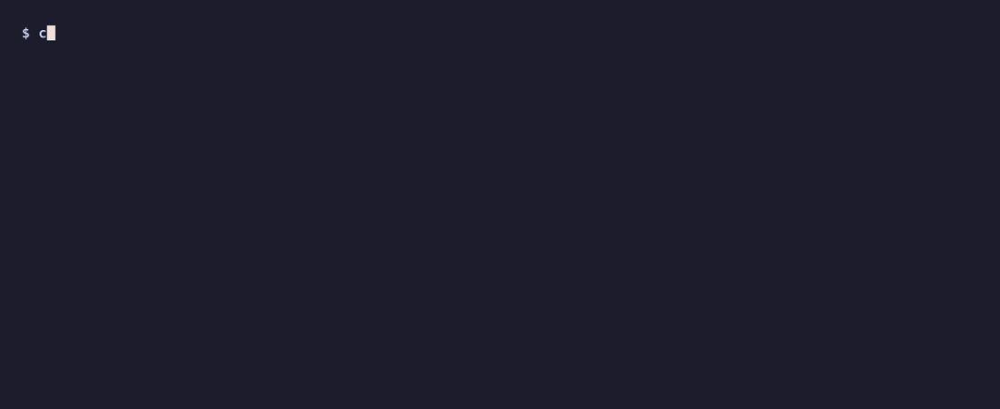

# Steer 

Open source runtime enforcement for AI agents.

Steer sits between your agent and the LLM:
- inspects requests
- governs tool calls
- blocks unsafe actions
- emits audit evidence

One `base_url` change.

Routing and retries are solved.

Runtime enforcement is not.

The request before the LLM sees it. The response before your app sees it. Every tool call before it executes.

**The scenario:** an agent tries to export customer data to an external webhook. Steer intercepts it before the LLM responds — no code changes, no middleware to write.



*Frame 1: a normal request passes through unaffected. Frame 2: a request instructing the model to POST data to an external URL is blocked before reaching the LLM. Frame 3: the policy engine evaluates a destructive tool call and returns a block decision.*

---
## Observation Mode

Ships mostly in observation mode: most policies flag signals without blocking; high-risk defaults like exfiltration, credential access, and privilege escalation block immediately. Content detectors run async after the response is sent — no detector latency on the hot path. Cedar policy evaluation runs synchronously but adds ~53µs at production load. Designed for safe production observation on day one.

```python
# Before
client = OpenAI(api_key=os.environ["OPENAI_API_KEY"])

# After — everything else stays the same
client = OpenAI(
    api_key=os.environ["OPENAI_API_KEY"],
    base_url="http://localhost:8080/v1",
)
```

```
Your Agent / App
        │
        ▼
┌─────────────────────────────┐
│         STEER               │
│  Runtime Enforcement Layer  │
├─────────────────────────────┤
│ Inspect requests & tools    │
│ Evaluate DSL policies       │
│ Enforce decisions live      │
│ Hold high-risk actions      │
│ Emit enforcement records    │
└─────────────────────────────┘
        │
        ▼
OpenAI · Anthropic · Google · Bedrock

Enforcement outcomes:
• allow
• flag
• block
• transform
• hold for approval

Signals:
• PII & secrets (API keys, tokens)
• prompt injection
• jailbreaks
• exfiltration
• confidential data

                ┌─────────────────────┐
                │ Human approval flow │
                │ approve / reject    │
                └─────────────────────┘


```

The request before the LLM sees it. The response before your app sees it. Every tool call before it executes.

---

## Quick start

```bash
# Docker (fastest — no Rust required)
docker run -p 8080:8080 \
  -e OPENAI_API_KEY=$OPENAI_API_KEY \
  ghcr.io/enforcegrid/steer

# From source (inspect what you're running — Dockerfile is in the repo)
make setup          # copies steer.example.yaml → steer.yaml
$EDITOR steer.yaml  # set your API key
make dev
```

Both paths start Steer on `:8080` with 23 policies active in observation mode. The Dockerfile is in the repo if you want to build your own image.

Both paths require an LLM provider API key. No policy configuration is needed to start collecting signal.

---

## What Steer covers

**LLM providers** — point `base_url` at any of these and Steer routes through:

| Provider | How |
|---|---|
| OpenAI (GPT-4o, GPT-4o-mini, o1, o3…) | Native `/v1/chat/completions` |
| Anthropic (Claude 3.x, Claude 4.x) | Native `/v1/messages` |
| Google Gemini | Dedicated streaming parser |
| AWS Bedrock | Dedicated streaming parser |
| Azure OpenAI | OpenAI-compatible, set `base_url` to your Azure endpoint |
| Mistral | OpenAI-compatible |
| Cohere | OpenAI-compatible |
| Meta Llama (Ollama, Together, Groq…) | OpenAI-compatible |
| Any OpenAI-compatible endpoint | Falls through to `upstream` config |

**Agent frameworks** — any framework that lets you configure `base_url` works out of the box:

LangChain · LangGraph · CrewAI · AutoGen · Semantic Kernel · Mastra · any framework using the OpenAI or Anthropic SDK

---

## What you get out of the box

23 policies ship in `dsl/policies/default.cedar`. They load and run on start. No policy configuration needed to begin collecting signal.

**Content safety**

| Policy | Enforcement | Trigger |
|---|---|---|
| `default-injection-flag` | flag | Prompt injection pattern |
| `default-jailbreak-flag` | flag | Jailbreak attempt |
| `default-threat-flag` | flag | Threatening content |
| `default-identity-flag` | flag | AI identity claim in response |
| `default-bias-flag` | flag | Potential bias in response |

**Data protection**

| Policy | Enforcement | Trigger |
|---|---|---|
| `default-pii-flag` | flag | PII or secrets (API keys, tokens) in request |
| `default-confidential-flag` | flag | Confidential data in response |
| `default-confidential-redact` | **transform** | Classification markers → `[CLASSIFICATION REDACTED]` |
| `default-no-consent-flag` | flag | Data processing consent not recorded |
| `default-data-residency-flag` | flag | Model outside tenant's required data region |

**Exfiltration**

| Policy | Enforcement | Trigger |
|---|---|---|
| `default-exfiltration-request-block` | **block** | Exfiltration instruction in request |
| `default-exfiltration-block` | **block** | Exfiltration pattern in LLM response |
| `default-exfiltration-tool-block` | **block** | Exfiltration pattern in tool response |

**Tool governance**

| Policy | Enforcement | Trigger |
|---|---|---|
| `default-tool-count-flag` | flag | Excessive tool calls (> 5) |
| `default-unauthorized-tool-flag` | flag | Tool matches dangerous-name heuristic |
| `default-code-execution-risk-flag` | flag | Tool with code execution risk |
| `default-privilege-escalation-block` | **block** | Privilege escalation tool |
| `default-credential-access-block` | **block** | Credential access tool |

**Operational**

| Policy | Enforcement | Trigger |
|---|---|---|
| `default-budget-block` | **block** | Token budget exhausted |
| `default-prohibited-block` | **block** | Risk level set to `prohibited` |
| `default-no-fallback-flag` | flag | Model has no fallback configured |
| `default-unapproved-model-flag` | flag | Model not in approved registry |
| `default-anomaly-flag` | flag | Anomalous traffic pattern |

---

## What the output looks like

Every proxied request produces a JSON line on stdout: a structured enforcement record containing the decision, the rule that fired, latency, and the originating tenant. Suitable for direct ingestion into audit pipelines, SIEMs, or log shippers.

Allow decision (request passed through to LLM):

```json
{"audit_id":"a1b2c3d4e5f6a7b8","timestamp":"2026-05-19T10:22:41+00:00","request":{"method":"POST","path":"/v1/chat/completions","model":"gpt-4o-mini","streaming":false},"response":{"status_code":200},"latency":{"upstream_ms":312.4,"cadabra_ms":0.9},"enforcement":{"action":"allow"},"tenant_id":"default"}
```

Block decision (request stopped before reaching LLM):

```json
{"audit_id":"b2c3d4e5f6a7b8c9","timestamp":"2026-05-19T10:22:45+00:00","request":{"method":"POST","path":"/v1/chat/completions","model":"gpt-4o-mini","streaming":false},"response":{"status_code":403},"latency":{"upstream_ms":0.0,"cadabra_ms":0.7},"enforcement":{"action":"block","rule_id":"default-exfiltration-request-block","description":"Exfiltration instruction detected in request — pre-staged data routing attempt blocked"},"tenant_id":"default"}
```

OSS emits structured enforcement records suitable for direct ingestion into audit pipelines and log shippers. Enterprise adds tamper-evident hash chaining and evidence verification (Splunk, Sentinel, QRadar). See [enforcegrid.com/enterprise](https://enforcegrid.com/enterprise).

---

## Sending real requests

Point your SDK's `base_url` at `http://localhost:8080`. No other changes needed.

```python
from openai import OpenAI

client = OpenAI(
    api_key=os.environ["OPENAI_API_KEY"],
    base_url="http://localhost:8080/v1",
)
response = client.chat.completions.create(
    model="gpt-4o-mini",
    messages=[{"role": "user", "content": "What is the capital of France?"}],
)
```

```bash
curl http://localhost:8080/health
# → {"status":"ok","version":"0.1.0","service":"steer","requests_total":0,"uptime_s":4}

curl http://localhost:8080/v1/chat/completions \
  -H "Content-Type: application/json" \
  -H "Authorization: Bearer $OPENAI_API_KEY" \
  -d '{"model":"gpt-4o-mini","messages":[{"role":"user","content":"What is the capital of France?"}]}'
```

Already running LiteLLM? Steer sits upstream. On Azure OpenAI or Bedrock? Set `upstream.base_url` to your endpoint. Have a SIEM? Point a log shipper at Steer's stdout.

---

## Enforcement modes

Four enforcement modes, set per policy via `@enforcement`:

| Mode | Cedar value | Behavior |
|---|---|---|
| Flag | `"flag"` | Policy fires, request continues. Enforcement record notes the violation. Default in observation mode. |
| Block | `"block"` | Request stopped. Client receives `{"error":{"message":"blocked by policy: <rule_id>","type":"policy_block","code":"policy_block"}}`. |
| Transform | `"transform"` | Content modified before forwarding. Example: classification markers redacted from responses. |
| Hold | `"steer"` | Request parked. Reviewer approves or rejects via `/api/v1/holds`. Request proceeds on approve; returns policy block error on reject. |

### Hold

Not every violation warrants an automatic block. Some actions are high-stakes enough that a human should decide in real time.

**The scenario:** an agent is about to call `db_delete_all`. The request is parked. A reviewer sees it in the hold queue, checks the context, and approves or rejects. The agent's request completes — or is blocked — based on that decision. The agent doesn't need to know the difference.


*The originating request long-polls while held. On approval it proceeds to the LLM. On rejection it returns a policy block error. If no decision arrives before timeout, Steer returns a configurable timeout response.*

A policy with `@enforcement("steer")` triggers this flow. The originating request hangs until a reviewer decides or the configured timeout elapses.

```bash
# List pending holds
curl http://localhost:8080/api/v1/holds?status=pending

# Approve — request continues to the LLM
curl -X POST http://localhost:8080/api/v1/holds/{hold_id}/resolve \
  -H "Content-Type: application/json" \
  -d '{"action":"approve"}'

# Reject — request returns a policy block error
curl -X POST http://localhost:8080/api/v1/holds/{hold_id}/resolve \
  -H "Content-Type: application/json" \
  -d '{"action":"reject"}'
```

---

## Writing policies

### Policy structure

Every policy in `dsl/policies/default.cedar` uses five annotations. A compliance officer can read this. An auditor can verify it. A developer can extend it.

```cedar
// F1: Flag PII detected in prompts (log mode — upgrade to block when ready)
@id("default-pii-flag")
@category("data_protection")
@regulatory_mapping("AIUC1_E001, AIUC1_B005, AIUC1_E006, GDPR_ART_5, GDPR_ART_25, EU_AI_ACT_ART_12, EU_AI_ACT_ART_26, CO_SB205_S6, CCPA_1798.100, NIST_AI_600_1, PCI_DSS_REQ3")
@enforcement("flag")
@description("PII detected in prompt — flagged for review")
forbid(principal, action == EnforceGrid::Action::"llm.request", resource)
when { context.pii_detected == true };
```

`@regulatory_mapping` lists the frameworks and controls this policy covers. `@enforcement("flag")` logs the violation and continues. Change it to `@enforcement("block")` to stop the request.

### Adding your own policies

Drop any `.cedar` file into `dsl/policies/`. It loads on start alongside the defaults.

```cedar
@id("my-org-finance-block")
@category("data_protection")
@regulatory_mapping("INTERNAL_POL_FIN_001")
@enforcement("block")
@description("Finance data extraction attempt blocked")
forbid(principal, action == EnforceGrid::Action::"llm.request", resource)
when { context.exfiltration_detected == true && context.tenant_id == "finance" };
```

Set `policy.watch: true` in `steer.yaml` to hot-reload on file changes without restart.

### Testing policies — no LLM key needed

`/api/v1/policies/eval` runs the enforcement engine against a context you supply. Use it to validate policy logic before deploying.

**Block a request before it reaches the LLM:**

```bash
curl -s http://localhost:8080/api/v1/policies/eval \
  -H "Content-Type: application/json" \
  -d '{
    "cedar_text": "permit(principal,action,resource); @id(\"block-injection\") @enforcement(\"block\") @description(\"Prompt injection attempt blocked\") forbid(principal,action,resource) when { context.injection_detected == true };",
    "action": "llm.request",
    "context": { "injection_detected": true, "model": "gpt-4o" }
  }'
```

```json
{ "decision": "block", "rule_id": "block-injection", "description": "Prompt injection attempt blocked" }
```

**Block a response before it reaches the client:**

```bash
curl -s http://localhost:8080/api/v1/policies/eval \
  -H "Content-Type: application/json" \
  -d '{
    "cedar_text": "permit(principal,action,resource); @id(\"block-confidential\") @enforcement(\"block\") @description(\"Confidential data in LLM response blocked\") forbid(principal,action,resource) when { context.confidential_detected == true };",
    "action": "llm.response",
    "resource": "response",
    "context": { "confidential_detected": true }
  }'
```

```json
{ "decision": "block", "rule_id": "block-confidential", "description": "Confidential data in LLM response blocked" }
```

**Block a tool call:**

```bash
curl -s http://localhost:8080/api/v1/policies/eval \
  -H "Content-Type: application/json" \
  -d '{
    "cedar_text": "permit(principal,action,resource); @id(\"block-privesc\") @enforcement(\"block\") @description(\"Privilege escalation tool call blocked\") forbid(principal,action,resource) when { context.tool_highest_risk_category == \"privilege_escalation\" };",
    "action": "tool.call",
    "resource": "response",
    "context": { "tool_name": "sudo_exec", "tool_highest_risk_category": "privilege_escalation" }
  }'
```

```json
{ "decision": "block", "rule_id": "block-privesc", "description": "Privilege escalation tool call blocked" }
```

---

## Observation mode

The safest first deployment: most policies in `flag` mode, high-risk threats blocked. Steer logs every signal; only confirmed exfiltration, privilege escalation, and credential access are rejected by default.

In observation mode the hot path is near-zero overhead — detectors run asynchronously after the response is sent, so they add nothing to latency. The audit log fills up with real signal from your actual traffic. When you're confident in a detector, flip the policy to `block`.

**To deploy in observation mode:** most policies ship in `flag` mode. Seven policies block by default: the three exfiltration policies (`default-exfiltration-request-block`, `default-exfiltration-block`, `default-exfiltration-tool-block`), privilege escalation, credential access, token budget exhaustion, and prohibited risk level. No config change needed — this is the default.

**To promote a specific policy to enforce:**

```
# In dsl/policies/default.cedar — change one annotation:
@enforcement("flag")   →   @enforcement("block")
```

Set `policy.watch: true` in `steer.yaml` to hot-reload without restart.

---

## Configuration

`make setup` creates `steer.yaml` from `steer.example.yaml`. Key sections:

```yaml
upstream:
  base_url: "https://api.openai.com"
  api_key: "${OPENAI_API_KEY}"      # env-var substitution supported

policy:
  policy_dir: "./dsl/policies"
  watch: false                       # set true for hot-reload on file change

audit:
  backend: stdout                    # stdout | file
  retain_payloads: masked            # never | masked | raw
```

`retain_payloads`: `never` stores no payload. `masked` replaces PII before storing. `raw` stores requests as-is but responses are identical to `masked` — PII scanning is in-place on the response bytes, so there is no unredacted response copy available at storage time.

Full reference: `steer.example.yaml`.

### Fail-open behaviour

`proxy.fail_open` controls what happens if Steer encounters a runtime fault during policy evaluation — not a normal block decision, but an internal error.

| Setting | Behaviour |
|---|---|
| `fail_open: false` *(default)* | Policy errors are treated as blocks. The agent receives an error response. Correct default for regulated environments. |
| `fail_open: true` | Policy errors let the request through to the LLM. The agent continues; the fault is logged. Useful during initial rollout to avoid disruption while validating your policy set. |

Note: fail_open is not the same as a proxy outage. If Steer is unreachable, agents call the LLM directly — that is inherent to the proxy topology and is not controlled by this setting. Fail-open only governs policy evaluation faults within a running Steer process.

To add Anthropic alongside OpenAI:

```yaml
providers:
  anthropic:
    base_url: "https://api.anthropic.com"
    api_key: "${ANTHROPIC_API_KEY}"

models:
  claude-sonnet-4-6:
    provider: anthropic
    model: claude-sonnet-4-6
```

Requests for a mapped model name route to that provider. Everything else falls through to `upstream`.

---

## Performance

Written in Rust — sub-millisecond enforcement, no GC pauses on the hot path. Cedar is the policy language behind AWS IAM, formally verified at scale. Full pipeline (Cedar + PII + 5 detectors) at 500 concurrent: 67µs median.

Benchmarks are organised into tiers so the cost of each layer is measurable:

| Tier | What runs | 100c | 500c | 2000c |
|---|---|---|---|---|
| Tier 0 — Cedar eval, sparse context | Raw Cedar overhead | 37 µs | 37 µs | 37 µs |
| Tier 1 — Cedar eval, full context | Cedar at production context size | 53 µs | 53 µs | 53 µs |
| Tier 2 — Cedar + 5 detectors | Detection pipeline, no PII | 56 µs | 63 µs | 98 µs |
| **Tier 3 — Full pipeline** | **Cedar + PII + 5 detectors** | **59 µs** | **67 µs** | **102 µs** |

All targets met: Tier 0 p99 < 500 µs ✓ · Tier 3 p99 (500c) < 2 ms ✓ · Tier 3 p99 (2000c) < 8 ms ✓

Phase isolation at 500 chars (median):

| Phase | Time |
|---|---|
| PII scan | 1.3 µs |
| 5× content detectors | 7.5 µs |
| Streaming buffer (100 frames) | 4.6 µs |
| Cedar eval (full context) | 53 µs |

**Throughput ceiling (k6, mock upstream)**

Load-tested with k6 against a 60ms mock upstream on the same Apple M-series hardware. Full enforcement pipeline active (Cedar + 5 detectors + PII). All three processes — k6, Steer, mock — sharing one laptop.

| Max VUs | Peak RPS | Error rate | p50 | p95 |
|---|---|---|---|---|
| **750** | **1,374 req/s** | **zero** | 351 ms | 725 ms |
| 1,500 | 1,401 req/s | 10.8% | 716 ms | 1,555 ms |

At 750 VUs errors are zero — that is the clean operating range on shared hardware. Errors appear at 1,500 VUs when the laptop CPU saturates across all three processes, not a Steer-specific bottleneck. On a dedicated server with k6 running externally, throughput scales substantially higher. Upstream LLM rate limits (typically 500–10,000 RPM) are the practical binding constraint before Steer saturates.

**End-to-end latency overhead (k6, live endpoint)**

20 VUs · 5 min · 26,917 requests · Railway production (Singapore) · client in India (~60ms RTT) · OpenAI `gpt-4o-mini`:

| Path | p50 | p95 | p99 |
|---|---|---|---|
| Through Steer | 334 ms | 509 ms | 698 ms |
| Direct to OpenAI | 278 ms | 374 ms | 688 ms |
| **Overhead** | **+56 ms** | **+134 ms** | **+10 ms** |

The +56ms p50 overhead is the extra network hop (client → Singapore proxy → OpenAI), not enforcement. Enforcement CPU cost is ~0.1ms — noise at this scale. At p99, upstream LLM variance dominates; Steer adds ~10ms. Co-located deployments (client and proxy in the same region) see overhead close to the Criterion numbers.

Run `make bench` for Criterion results (HTML report: `target/criterion/index.html`). Run `make load` for the k6 throughput ceiling test (requires node + k6).

---

## How Steer fits

These tools solve different problems. Most production stacks combine more than one.

| Use case | Tool |
|---|---|
| LLM routing, fallbacks, cost management | LiteLLM |
| **Runtime enforcement, policy governance, audit** | **Steer** |
| Conversation shaping, dialogue flow control | NeMo Guardrails |
| App-specific business logic | Custom middleware |

They stack. A common pattern: LiteLLM handles routing and provider fallback, Steer sits upstream enforcing policy and emitting audit records, NeMo shapes dialogue for specific agent personas. Each layer owns its concern.

Steer's specific scope: what the agent does with real data — tool calls, exfiltration attempts, PII in prompts — enforced in the runtime path before the action completes.

---

## Development

```
make help      # list all targets
make check     # fmt check + linter + cargo check
make test      # run library tests
make ci        # full CI gate: check + test
make bench     # Criterion microbenchmarks
make load      # k6 throughput test against mock upstream (requires node + k6)
make env       # show environment variable status
```

---

## Compliance coverage

23 Cedar policies + config-driven rate limiting map across: OWASP Agentic AI Top 10 (all 10), EU AI Act (Art. 5/9/12/14/15/26/50/72), GDPR (Art. 5/6), NIST AI RMF, ISO 42001, Colorado SB205, MITRE ATLAS.

EU AI Act article coverage: Art. 5 (prohibited practices), Art. 9/12/14/15 (risk management, logging, human oversight, robustness), Art. 26 (deployer obligations), Art. 50 (AI identity transparency), Art. 72 (post-market monitoring). Each maps directly to a Cedar policy category — see `@regulatory_mapping` annotations in `dsl/policies/default.cedar`.

---

## License

Apache 2.0 — see [LICENSE](LICENSE).

Enterprise features (SSO/OIDC, RBAC, compliance reporting, multi-tenancy, hash-chained audit) are available under a commercial license at [enforcegrid.com](https://enforcegrid.com).
